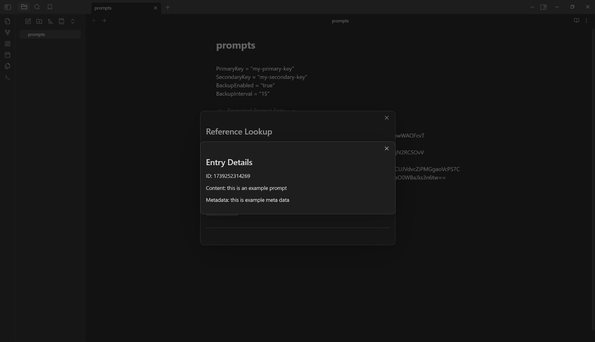

<p align="center">
  
</p>

<p align="center">
  <b>Prompt Silo</b>
</p>

<p align="center">
  a private prompt management system for Obsidian
</p>

<p align="center">
  <a href="https://opensource.org/license/0bsd">
    
  </a>
</p>

## About

**Prompt Silo** is a secure, offline-first prompt management system built to protect the strategic assets of prompt design. Developed as an Obsidian community plugin, it acknowledges that well-crafted prompts are not just text—they are intellectual property, vital assets that offer a distinct competitive advantage in the rapidly growing AI domain. At its core, Prompt Silo is grounded in the belief that our prompts, shaped by countless subtle interactions with artificial intelligence, represent much more than simple queries. They are the digital remnants of our thought processes, creativity, and the ever-evolving relationship we have with technology. In preserving these invaluable artifacts, Prompt Silo ensures they are protected with the highest standards of security.

## Installation

### Prerequisites

To install this plugin, you'll need:

- [Git](https://git-scm.com/) installed on your local machine.
- A local development environment for [Node.js](https://nodejs.org/).

### Step 1 : Download the Plugin

First, you'll need to download the plugin to the `plugins` directory in your vault's `.obsidian` directory so that Obsidian can find it.

1. Open a terminal window and change the project directory to the `plugins` directory.

```
cd path/to/vault
mkdir .obsidian/plugins
cd .obsidian/plugins
```

2. Clone the plugin using `Git`.

```
git clone https://github.com/arighosh05/prompt-silo.git
```

### Step 2 : Build the Plugin

Next, you'll need to compile the plugin so that Obsidian can load it.

1. Navigate to the plugin directory.

```
cd prompt-silo
```

2. Install dependencies.

```
npm install
```

3. Compile the source code.

```
npm run build
```

### Step 3 : Enable the Plugin

Finally, you'll need to enable the plugin to use it in Obsidian.

1. In Obsidian, open Settings.
2. In the side menu, select Community plugins.
3. Select Turn on community plugins.
4. Under Installed plugins, enable Prompt Silo by selecting the toggle button next to it.

You're now ready to use the Prompt Silo in Obsidian.

## Tutorial

Follow this tutorial to familiarize yourself with this plugin.

Navigate to the file you want to store your prompts in and insert the following lines at the top with your desired keys and backup settings:

```
PrimaryKey = "my-primary-key"			
SecondaryKey = "my-secondary-key"
BackupEnabled = "true"
BackupInterval = "15"
```

`PrimaryKey` encrypts the main content and metadata, while `SecondaryKey` encrypts reference data. `BackupEnabled` toggles automated backups on/off via `true`/`false`, and `BackupInterval` refers to the interval, in minutes, between automated backups.

<p align="center">
  
</p>

Navigate to the command palette via `Ctrl+P` on Windows or `Cmd+P` on macOS. 

Search for `Prompt Silo: Add Prompt Entry`.

<p align="center">
  
</p>

Add the entry.

<p align="center">
  
</p>

The prompt is encrypted and stored in the file.

<p align="center">
  
</p>

Navigate to the command palette via `Ctrl+P` on Windows or `Cmd+P` on macOS. 

Search for `Prompt Silo: Reference Lookup`.

<p align="center">
  
</p>

The reference lookup is accessible via the `Secondary Key`. 

<p align="center">
  
</p>

Click on `View Details` to access the prompt via the `Primary Key`.

<p align="center">
  
</p>

Navigate to the command palette via `Ctrl+P` on Windows or `Cmd+P` on macOS. 

Search for `Prompt Silo: Decrypt Prompt Entry`.

<p align="center">
  
</p>

Since the `Primary Key` is intact, the prompts are decrypted via the `Primary Key`.

<p align="center">
  
</p>

Add the following prompt entry.

<p align="center">
  
</p>

The encrypted prompt is stored in the file.

<p align="center">
  
</p>

Decrypt the image. Since the prompt contains PII, it is redacted.

<p align="center">
  
</p>

Modify the `Primary Key` to `not-my-primary-key`. Attempt to decrypt fails since `Primary Key` is incorrect.

<p align="center">
  
</p>

Since `Secondary Key` is intact, reference lookup is available.

<p align="center">
  
</p>

Search the tags in the reference lookup.

<p align="center">
  
</p>

Since `Primary Key` is incorrect, `View Details` fails.

<p align="center">
  
</p>

Modify the `Seconday Key` to `not-my-secondary-key`. Attempt to access reference lookup fails.

<p align="center">
  
</p>

Observe that after `BackupInterval` minutes, the prompts are stored in `Prompts.md` file.

## Meta

Aritra Ghosh – aritraghosh543@gmail.com

Distributed under the 0BSD license. See `LICENSE` for more information.

[https://github.com/arighosh05/](https://github.com/arighosh05/)

## Contributing

1. Fork it (<https://github.com/arighosh05/prompt-silo/fork>)
2. Create your feature branch (`git checkout -b feature/fooBar`)
3. Commit your changes (`git commit -am 'Add some fooBar'`)
4. Push to the branch (`git push origin feature/fooBar`)
5. Create a new Pull Request
